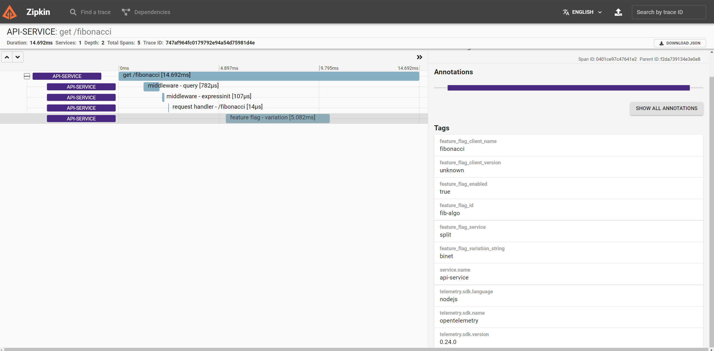

# OpenFeature API and SDK Experimentation

[](http://github.com/badges/stability-badges)

The purpose of this repository is to experiment with different techniques in
order to help define the initial spec of OpenFeature. It was inspired by the
OpenTelemetry SDK, with a focus on the design principles outlined in the
[spec](https://github.com/open-feature/spec#design-principles). These experiments
were written in TypeScript and focus on NodeJS, but the basic concepts should be
language agnostic.

## Getting started

To run the demo scenarios described on this page, please make sure you have the
following prerequisites configured on your system.

- Git
- NodeJS 14 or later
- Docker

You can then clone the repo and install the dependencies.

1. clone the repo: `git clone https://github.com/open-feature/sdk-research.git`
1. Install dependencies: `npm ci`

Available demos:

- [No-op](#no-op-demo)
- [Environment Variable Provider](#environment-variable-provider-demo)
- [Split Provider](#split-provider-demo)
- [CloudBees Feature Management Provider](#cloudbees-fm-provider-demo)
- [LaunchDarkly Provider Demo](#launchdarkly-provider-demo)
- [Flagsmith Provider Demo](#flagsmith-provider-demo)
- [OpenTelemetry and Zipkin](#opentelemetry-demo)
- [Validation Hook Demo](#validation-hook-demo)

## Create a new provider

Providers are an important part of OpenFeature. They're responsible for
performing the flag evaluation and must adhere to the feature flag API. To get
started, run the following command:

`npm run provider-generator`

You'll need to provide a name for the generator. After that, the output will
contain the path to the new provider class and a start command.

## Simple API

A core design principle of OpenFeature is a simple, understandable API. OpenFeature's API needs to be flexible enough to handle all the common use cases
of feature flags while being easy to work with. In order to support this, a
common API needs to be defined that's capable of supporting core feature
flagging use cases. The method names and signatures still need to be agreed upon
by the community, but a basic implementation can be found [here](./packages/openfeature-js/src/lib/types.ts).

### Global Singleton

Inspired by OpenTelemetry, this experimental SDK registers itself globally.
Typically doing this is discouraged but, in this case, it provides interesting
flexibility. It allows library maintainers to include OpenFeature in their
project, even if they're running a different, but compatible version of
OpenFeature. An example of how this could be used can be found in the [Fibonacci
library](./packages/fibonacci/src/lib/fibonacci.ts).

### Provider Registration

OpenFeature allows developers to register a provider. Providers are responsible for
using the flag identity and context to determine the state of the feature. If no
providers are registered, the flags will no-op and return the default value.

### No-op Demo

To see this in action, we'll run the API app found
[here](./packages/api/src/main.ts). Notice that we're using OpenFeature but not
registering a provider. Let's run the app and see what happens.

1. Run `npm run no-op-demo`
2. Open http://localhost:3333/api in your browser

That's it! You should see **Welcome to the api!**. Unfortunately, that's all you
can do without registering a provider. Thankfully, as we'll see in the next
section, that part is easy.

## Compatibility

Another key design principle of OpenFeature is compatibility with existing open source
and commercial feature flag offerings. It should be possible to register a
feature flag provider that's responsible for handling the flag evaluation. Only
a single provider can be registered at a time and not providing one will cause
flag evaluations to return the default value. This can be tested by running the
application without registering a provider.

> NOTE: You may notice that the demos below don't register providers
> directly in the [app](./packages/api/src/main.ts). This is done before the
> main app starts using the `-r` node cli argument. The config can be found [here](./packages/api/project.json).

### Environment Variable Provider Demo

The environment variable provider is a simple demo showing how environment
variables could be used make flag evaluations. Its purpose is to show how a
provider **could** be implemented.

Follow these steps to run the demo:

1. copy `.env.example` to `.env`
2. Run `npm run env-var-demo`
3. Open http://localhost:3333/api in your browser

You should see **Welcome to the api!** just as before. Now, change the value of
`new-welcome-message` to true and restart the app. It should show **Welcome
to the next gen api!** in your browser. Now we're getting somewhere, but
it's still a bit too basic to be useful. The next demo will show how we could
register a commercial feature flag tool using an existing SDK.

### Split Provider Demo

The Split provider shows how an existing SDK, in this case Split's NodeJS SDK, can
be used in OpenFeature. This is a simple example that doesn't cover every use
case that Split offers, but the goal would be to support as many features as
possible.

Follow these steps to run the demo:

1. Copy `.env.example` to `.env`
2. Add a Split.io [service-side API
   key](https://help.split.io/hc/en-us/articles/360019916211-API-keys) to the
   `SPLIT_KEY` in the `.env` file.
3. Create a new split called `new-welcome-message` with the default treatments
4. Create a new split called `fib-algo` with the treatment values: `recursive`,
   `memo`, `loop`, `binet`, and `default`.
5. Create a new split called `hex-color` with the treatment values: `CC0000`,
   `00CC00`, `0000CC`, `chartreuse`.
6. Run `npm run split-demo` and visit http://localhost:3333/api, http://localhost:3333/hello, or http://localhost:3333/fibonacci?num=40

### CloudBees FM Provider Demo

A CloudCees Feature Management provider demo.

Follow these steps to run the demo:

1. Copy `.env.example` to `.env`
2. Add a CloudBees app key to the `.env` file.
3. Create a new boolean flag called `new-welcome-message`.
4. Create a new flag called `fib-algo` with the values: `recursive`,
   `memo`, `loop`, `binet`, and `default`.
5. Create a new flag called `hex-color` with the values: `CC0000`,
   `00CC00`, `0000CC`, `chartreuse`.
6. Run `npm run cloudbees-demo` and visit http://localhost:3333/api, http://localhost:3333/hello, or http://localhost:3333/fibonacci?num=40

### LaunchDarkly Provider Demo

A LaunchDarkly provider demo.

Follow these steps to run the demo:

1. Copy `.env.example` to `.env`
2. Add a LaunchDarkly SDK key to the `.env` file.
3. Create a new boolean flag called `new-welcome-message`.
4. Create a new feature flag called `fib-algo` with the values: `recursive`,
   `memo`, `loop`, `binet`, and `default`.
5. Create a new feature flag called `hex-color` with the values: `CC0000`,
   `00CC00`, `0000CC`, `chartreuse`.
6. Run `npm run launchdarkly-demo` and visit http://localhost:3333/api, http://localhost:3333/hello, or http://localhost:3333/fibonacci?num=40

### Flagsmith Provider Demo

A Flagsmith provider demo (supports v1 and v2).

Follow these steps to run the demo:

1. Copy `.env.example` to `.env`
2. Add a Flagsmith Environment ID (v1) or a Environment key (v2) to the `.env` file.
3. Create a new boolean feature called `new-welcome-message`.
4. Create a new feature called `fib-algo` with the values: `recursive`,
   `memo`, `loop`, `binet`, and `default`.
5. Create a new feature called `hex-color` with the values: `CC0000`,
   `00CC00`, `0000CC`, `chartreuse`.
6. Run `npm run flagsmith-v1-demo` or `npm run flagsmith-v2-demo` and visit http://localhost:3333/api, http://localhost:3333/hello, or http://localhost:3333/fibonacci?num=40

## OpenTelemetry Support

Now, wouldn't it be nice if you could visually see the impact an algorithm had
on a request? That's where OpenTelemetry support comes in.

Supporting OpenTelemetry natively in OpenFeature provides a number of
advantages. The most obvious benefit is distributed traces would contain
feature flag information. This would make it easy to determine
the impact a feature or features had on a single request. Other features, such as
baggage and request scoped context, may be useful options in the future.

OpenTelemetry is not required to use OpenFeature. Similar to OpenFeature, if a
provider is not registered, the library no-ops. That means you are able to take
advantage of all the great features of OpenTelemetry if you already use it, with minimal
overhead if you don't.

### OpenTelemetry Demo

1. Start Zipkin in Docker: `docker run --rm -d -p 9411:9411 --name zipkin openzipkin/zipkin`
2. Open http://localhost:9411/ in your browser
3. Start one of the demos above or run `npm run no-op-demo`
4. Open Zipkin and search for a trace



Experiment with different Fibonacci algorithms and hitting the API with these
values:

- http://localhost:3333/fibonacci?num=10
- http://localhost:3333/fibonacci?num=20
- http://localhost:3333/fibonacci?num=30
- http://localhost:3333/fibonacci?num=40
- http://localhost:3333/fibonacci?num=50

### Validation Hook Demo

"After" hooks can be used validate and intercept flag values. This is particularly useful
if non-technical personnel have access to make changes to the feature flag values. Validators can
ensure that only logical valid values for flags propagate through code.

1. Start a provider demo (ie: `npm run env-var-demo`)
2. Open http://localhost:3333/hello in your browser
3. Change the value to any valid CSS hex value (ie: `AABB00`) and observe that value is used in the returned markup
4. Change the value to any invalid CSS hex value (ie: `chartreuse`) and observe that value falls back to `000000`

### Baggage

OpenTelemetry supports the w3c baggage standard by default. Extensive testing of
baggage was out of scope for this experiment, but it's worth mentioning the
potential value it could provide. Baggage is a set of user-defined properties
that are associated with a request across a distributed system. In the context of
a feature flag, it could be useful for evaluation caching or passing useful context
to downstream services.

The implementation of baggage in the node.js SDK is low level and not well
documented. Baggage is also immutable according to the [OpenTelemetry
spec](https://github.com/open-telemetry/opentelemetry-specification/blob/main/specification/baggage/api.md#overview).

The following example shows a baggage could be created or extended in
an express middleware function. OpenFeature could then read baggage and merge it
with existing context.

```typescript
app.use(async (req, res, next) => {
  const key = 'new-welcome-message';
  const value = 'true';
  const baggage = propagation.getBaggage(context.active());
  context.with(
    propagation.setBaggage(
      context.active(),
      baggage
        ? baggage.setEntry(key, { value })
        : propagation.createBaggage({ [key]: { value } })
    ),
    next
  );
});
```

It's also possible to set the header key `baggage` with a value like `foo=bar`.
OpenTelemetry will then pass this value via baggage through the entire request.
This could be used in OpenFeature to explicitly enable a feature flag using a
header.

## Open Questions

- What should happen if multiple providers are registered?
- Could something similar to an OpenAPI be used to describe feature flags in code?
- What OpenTelemetry semantic naming prefix should be used?
- Can we cache flag evaluation using the trace ID?
