<picture>
  <source media="(prefers-color-scheme: dark)" srcset="./images/openfeature-horizontal-white.svg">
  <source media="(prefers-color-scheme: light)" srcset="./images/openfeature-horizontal-black.svg">
  
</picture>

## Welcome to the OpenFeature playground

The OpenFeature playground is a great place to familiarize yourself with the core concepts and features available in OpenFeature.
If you're brand new to feature flagging, consider reviewing the [What are feature flags?](https://openfeature.dev/docs/reference/intro/#what-are-feature-flags) section in our documentation before running the demo.

<!-- Can be updated automatically by running `npm run markdown-toc` >

<!-- toc -->

- [Pre-requisites](#pre-requisites)
- [How to run the demo](#how-to-run-the-demo)
- [What's in the demo?](#whats-in-the-demo)
  - [Rebranding](#rebranding)
  - [Experimenting with color](#experimenting-with-color)
  - [Test in production](#test-in-production)
- [Available providers](#available-providers)
  - [Environment Variable](#environment-variable)
  - [flagd](#flagd)
  - [Go Feature Flag](#go-feature-flag)
  - [CloudBees Feature Management](#cloudbees-feature-management)
  - [Split](#split)
  - [Harness](#harness)
  - [LaunchDarkly](#launchdarkly)
  - [Flagsmith](#flagsmith)
  - [Flipt](#flipt)
- [Experimenting beyond the demo](#experimenting-beyond-the-demo)
  - [Evaluation context](#evaluation-context)
- [Troubleshooting](#troubleshooting)
  - [Ports are not available](#ports-are-not-available)
  - [Vendor isn't listed in the dropdown](#vendor-isnt-listed-in-the-dropdown)
  - [The UI is always grey](#the-ui-is-always-grey)

<!-- tocstop -->

## Pre-requisites

In order to run the demo, you'll need the following tools available on your system.

- [git](https://git-scm.com/book/en/v2/Getting-Started-Installing-Git)
- [Docker Engine](https://docs.docker.com/engine/install/)
- [Docker Compose](https://docs.docker.com/compose/install/)

## How to run the demo

1. Clone the repo

   ```sh
   git clone https://github.com/open-feature/playground.git
   ```

1. Navigate to the playground folder

   ```sh
   cd playground
   ```

1. Copy `.env.example` to `.env`

   ```sh
   cp .env.example .env
   ```

1. Optionally, add feature flag vendors to the `.env`. [See below](#available-providers) for more information.
1. Start the demo

   ```sh
   docker compose up
   ```

1. Open your favorite browser and navigate to http://localhost:30000/

## What's in the demo?

The demo consists of three different scenarios where feature flags are used. They help the fictional company Fib3r safely test and release new features. Two of the flags are `client-side` flags, which are evaluated in the web browser. One is a `server-side` flag, which is evaluated on the web server. 

### Rebranding

As we all know, naming is hard! In this scenario, the team at Fib3r is in the process of rebranding from `FaaS` to `Fib3r`. This may seem like a situation where a feature flag is unnecessary. However, many times, a rebranding needs to correspond with a press release or blog post. Of course, you could time a deployment moments before the announcement, but that's potentially risky and may require coordination across multiple teams. Using a feature flag would allow you to deploy when it's convenient, test in production by enabling the feature for a subset of users, and then enable it instantly for everyone.

For the rebranding effort, we're only interested in being able to toggle the new welcome message on and off. A boolean value is exactly what we need! That can be accomplished in OpenFeature like [this](https://github.com/open-feature/playground/blob/main/packages/ui/src/app/demos/fib3r/fib3r-demo.tsx#:~:text=getBooleanValue).

### Experimenting with color

The team at Fib3r has a hypothesis. They feel that the reason Fib3r hasn't achieved unicorn status is that the current color of the landing page is responsible for high bounce rates. This is a great opportunity to use feature flags for experimentation. With feature flags, it's possible to measure the impact a change has on the metrics that are important to your business.

[Diving into the code](https://github.com/open-feature/playground/blob/main/packages/ui/src/app/demos/fib3r/fib3r-demo.tsx#:~:text=getStringValue), you may notice that an `after` hook has been defined. [Hooks](https://openfeature.dev/docs/reference/concepts/hooks) are a powerful feature that can be used to extend OpenFeature capabilities. In this case, the code expects a valid CSS hex color value. However, _the person configuring the feature flag in a remote feature flag management tool may not be aware of this requirement_. That's where a validation hook could be used to ensure only valid CSS values are returned. In this hook, the evaluated value is tested against a regular expression. If it doesn't match, a warning message is logged, and the hook throws an error. OpenFeature will catch the error and return the default value.

### Test in production

Fib3r is on a mission to help the world calculate the nth digit of Fibonacci more efficiently. According to a Stack Overflow article the team recently found, it's possible to use Binet's Formula to calculate Fibonacci more efficiently. While the initial tests look promising, changing the underlying algorithm Fib3r has used for years is risky. The team decided that it would be safer put the new feature behind a context-dependant feature flag so that only employees could use it initially. If the test goes well, the feature could be slowly rolled out to everyone or quickly reverted if an issue is discovered.

Let's see how this could be done using OpenFeature. [Here](https://github.com/open-feature/playground/blob/main/packages/fibonacci/src/lib/fibonacci.ts) is where the Fib3r team adds a feature flag that returns the name of the algorithm to run. Looking closely at the `getStringValue` method, you'll notice [evaluation context](https://openfeature.dev/docs/reference/concepts/evaluation-context) is not being defined. Evaluation context is commonly used in feature flagging to determine the flag value dynamically. For example, the Fib3r team may want to test the `binet` algorithm on employees only. This can be done by setting the user's email address as evaluation context and defining a rule that returns `binet` only when the email address ends with `@faas.com`. Simple enough, but remember that the evaluation context wasn't explicitly set during the flag evaluation linked above. That's because OpenFeature allows developers to set evaluation context at various points in their application. In this case, evaluation context is set [on each transaction](https://github.com/open-feature/playground/blob/main/packages/app/src/app/transaction-context.middleware.ts) and automatically used during flag evaluation.

## Available providers

The following [providers](https://openfeature.dev/docs/reference/concepts/provider) can be used in the demo. Locate the provider you're interested in using to learn more.

### Environment Variable

The environment variable provider is a simple demo showing how environment
variables could be used to make flag evaluations. Its purpose is to show how a basic
provider **could** be [implemented](https://github.com/open-feature/playground/blob/main/packages/js-env-provider/src/lib/js-env-provider.ts).

To get started, follow the instructions in the [How to run the demo](#how-to-run-the-demo) section. Once in the demo app, select `env` from the dropdown located at the bottom-right of the screen. To change a flag value, open the `.env` file in your favorite text editor. Update the flag values based on the options defined as comments above the flag key. When you're ready, save the file and restart the demo.

Using environment variables like this can be a good way to get started with feature flagging. However, the approach only supports basic use cases and is quite cumbersome.

### flagd

[flagd](https://github.com/open-feature/flagd) is an OpenFeature compliant flag evaluation daemon.
Following the Unix philosophy, it provides one component of a full feature flagging solution: a service for storing and evaluating flags.
It supports the ability to define flag configurations in various locations, including a local file, an HTTP service, or in the case you're using Kubernetes, directly from the Kubernetes API.

In this demo, FlagD starts automatically as part of the Docker Compose file. It's configured to watch a local file `/config/flagd/flags.json` for flag configurations. Feel free to modify this file and see how it affects the demo. Valid configuration changes should be reflected almost immediately.

<details>
  <summary>Flag Configuration in FlagD</summary>

A FlagD configuration is represented as a JSON object. Feature flag configurations can be found under `flags`, and each item within `flags` represents a flag key (the unique identifier for a flag) and its corresponding configuration.

Valid flag configuration options include:

##### State

`state` is **required** property. Validate states are "ENABLED" or "DISABLED". When the state is set to "DISABLED", FlagD will behave like the flag doesn't exist.

Example:

```
"state": "ENABLED"
```

##### Variants

`variants` is a **required** property. It is an object containing the possible variations supported by the flag. All the object's values **must** be the same type (e.g. boolean, numbers, string, JSON). The type used as the variant value will directly affect how the flag is accessed in OpenFeature. For example, to use a flag configured with boolean values, the `getBooleanValue` or `getBooleanDetails` methods should be used. If another method, such as `getStringValue` is called, a type mismatch occurs and the default value is returned.

Example:

```
"variants": {
  "red": "c05543",
  "green": "2f5230",
  "blue": "0d507b"
}
```

Example:

```
"variants": {
  "on": true,
  "off": false
}
```

Example of an invalid configuration:

```
"variants": {
  "on": true,
  "off": "false"
}
```

##### Default Variant

`defaultVariant` is a **required** property. The value **must** match the name of one of the variants defined above. The default variant is always used unless a targeting rule explicitly overrides it.

Example:

```
"variants": {
  "on": true,
  "off": false
},
"defaultVariant": "off"
```

Example:

```
"variants": {
  "red": "c05543",
  "green": "2f5230",
  "blue": "0d507b"
},
"defaultVariant": "red"
```

Example of an invalid configuration:

```
"variants": {
  "red": "c05543",
  "green": "2f5230",
  "blue": "0d507b"
},
"defaultVariant": "purple"
```

##### Targeting Rules

`targeting` is an **optional** property. A targeting rule **must** be valid JSON. FlagD uses a modified version of [JSON Logic](https://jsonlogic.com/), as well as some custom pre-processing, to evaluate these rules. The output of the targeting rule **must** match the name of one of the variants defined above. If an invalid or null value is returned by the targeting rule, the `defaultVariant` value is used.

The [JSON Logic playground](https://jsonlogic.com/play.html) is a great way to experiment with new targeting rules. The following example shows how a rule could be configured to return `binet` when the email (which comes from the evaluation context) contains `@faas.com`. If the email wasn't included in the evaluation context or didn't contain `@faas.com`, null is returned, and the `defaultVariant` is used instead. Let's see how this targeting rule would look in the JSON Logic playground.

1. Open the [JSON Logic playground](https://jsonlogic.com/play.html) in your favorite browser
2. Add the following JSON as the `Rule`:

```json
{
  "if": [
    {
      "in": [
        "@faas.com",
        {
          "var": ["email"]
        }
      ]
    },
    "binet",
    null
  ]
}
```

3. Add the following JSON as the `Data`:

```json
{
  "email": "test@faas.com"
}
```

4. Click `Compute`
5. confirm the output show `"binet"`
6. Optionally, experiment with different rules and data

</details>

### Go Feature Flag

[Go Feature Flag](https://gofeatureflag.org/) is a open source feature flagging solution. It can define flag configurations in various locations (HTTP, S3, GitHub, file, Google Cloud Storage, Kubernetes). OpenFeature is able to integrate with Go Feature Flag by using the [Go Feature Flag Relay Proxy](https://github.com/thomaspoignant/go-feature-flag-relay-proxy).

In this demo, Go Feature Flag starts automatically as part of the Docker Compose file. It's configured to watch a local file `/config/go-feature-flag/flags.yaml` for flag configurations. Feel free to modify this file and see how it affects the demo. Valid configuration changes should be reflected almost immediately. Documentation on how to configure a flag can be found [here](https://docs.gofeatureflag.org/v0.28.0/flag_format/).

### CloudBees Feature Management

[CloudBees Feature Management](https://www.cloudbees.com/capabilities/feature-management) is an advanced feature flagging solution that lets your development teams quickly build and deploy applications without compromising on safety. By providing a gradual release mechanism and a simple way to define target audiences, CloudBees Feature Management allows developers and product managers to optimize feature releases and customize the user experience. CloudBees Feature Management gives teams control over features that are in staging, production, or any environment in the deployment pipeline.

<details>
  <summary>Follow these steps to set up CloudBees for the demo:</summary>

1. Sign in to your CloudBees Feature Management account. If you don't already have an account, you can use the [free community edition](https://www.cloudbees.com/c/feature-management-free-trial-sign-up).
1. Within the CloudBees Feature Management UI, add a new application called `OpenFeature playground`. You can keep the default environment of `production`.
1. In `App Settings` add a new custom STRING property called `email` as shown below. This is used in the `fib-algo` configuration to control the flag value via the email of the user logging into the playground application.

    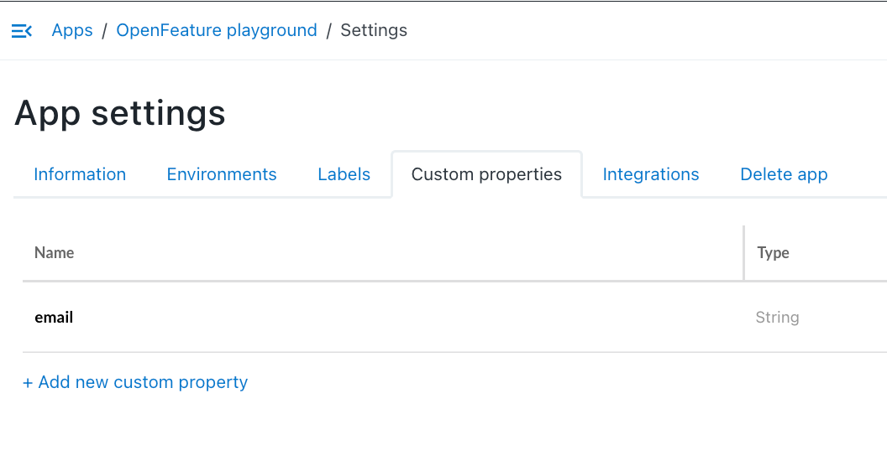

1. Create a new boolean flag called `new-welcome-message`.
1. Create a new flag called `hex-color` with the values: `c05543`, `2f5230`, and `0d507b`.

    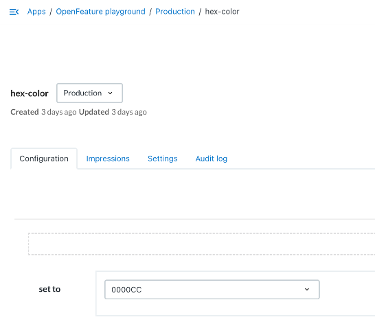

1. Create a new flag called `fib-algo` with the values: `recursive`, `memo`, `loop`, `binet`, and `default`.
1. For the `fib-algo` flag, add a configuration. This can be a combination of the `email` regEx of `.*faas.com$` and set `recursive` in the else section.

    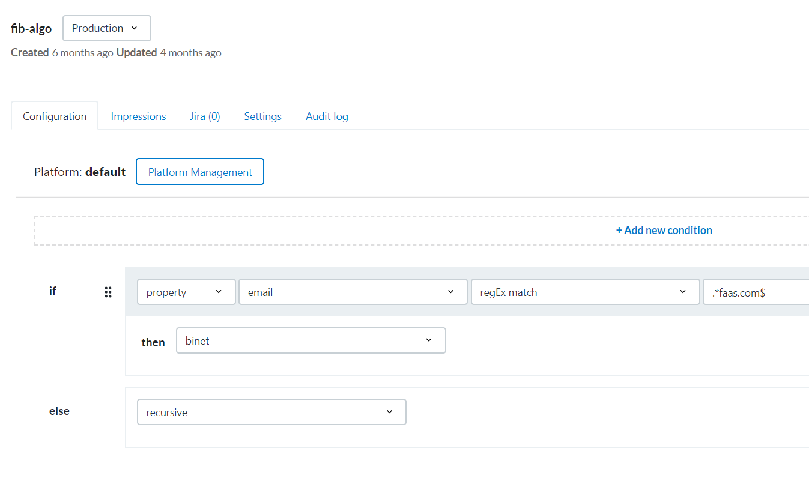

1. Ensure for each flag, the configuration switch is set to ON, as shown below

    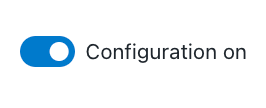

1. Ensure the completed list of flags looks as follows

    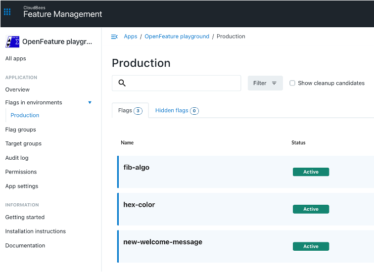

1. Copy the production environment key found under `App settings` > `Environments`
1. Open the `.env` file and make the value of `CLOUDBEES_APP_KEY` the key copied above

Now that everything is configured, you should be able to [start the demo](#how-to-run-the-demo). Once it's started, select `cloudbees` from the provider list located at the bottom right of your screen. You should now be able to control the demo app via CloudBees! Note that for "UI" flags (`hex-color`, `new-welcome-message`) you have to select `Platform: Browser` in the platform dropdown when modifying flag values.
</details>

### Split

[Split](https://www.split.io/) is a unified feature flagging and experimentation platform enabling product and engineering teams to reduce cycle times, mitigate release risk, and maximize business impact throughout the [Feature Delivery Lifecycle](https://www.split.io/product/feature-delivery-lifecycle/).

<details>
  <summary>Follow these steps to set up Split for the demo:</summary>

1. Sign in to your Split account. If you don't already have an account, you can use the [Split Free Edition](https://www.split.io/signup/).
1. Create a new split called `new-welcome-message` and use the default treatments.

    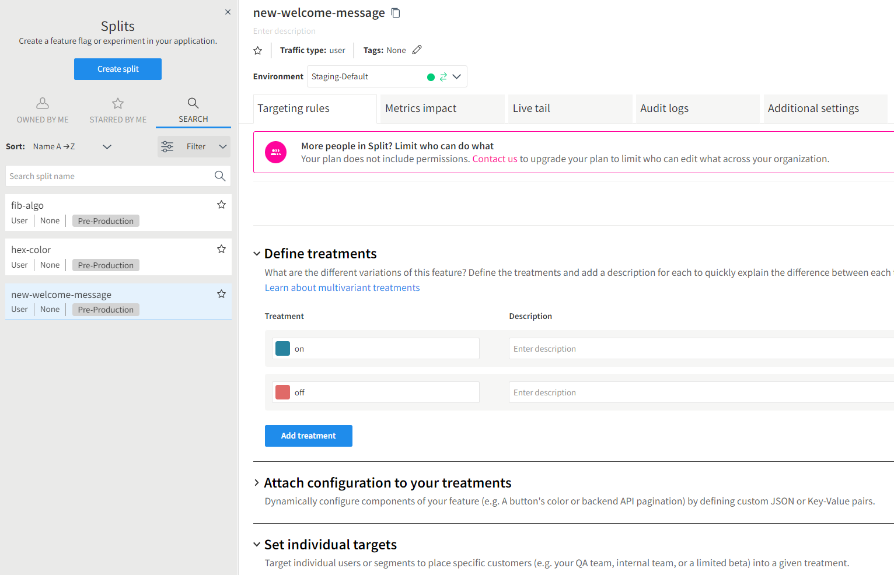

1. Create a new split called `hex-color` with the treatments: `c05543`, `2f5230`, and `0d507b`.

    

1. Create a split called `fib-algo` with the values: `recursive`, `memo`, `loop`, `binet`, and `default`.

    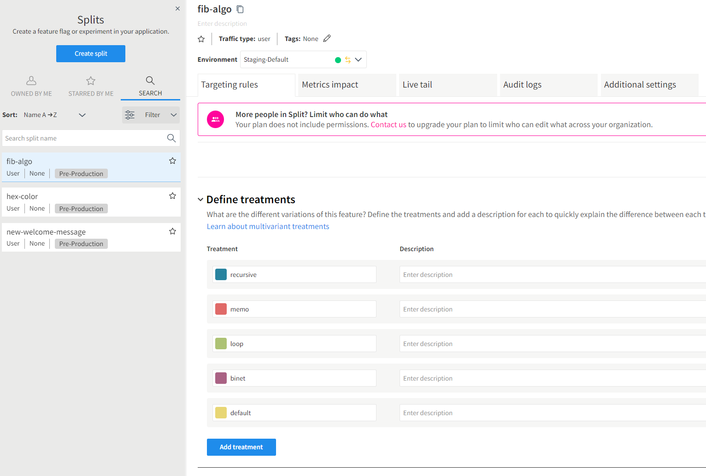

1. For the `fib-algo` flag, add a targeting rule that serves `binet` if the emails email address ends with `@faas.com`.

    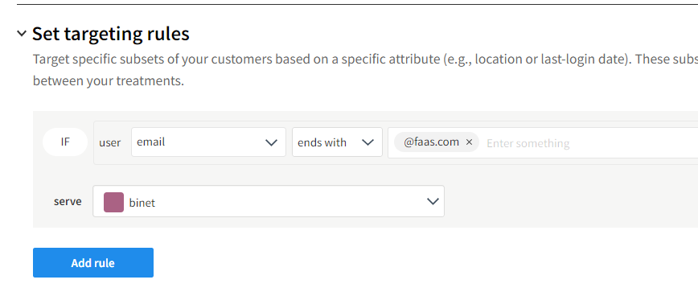

1. Create a new [server-side](https://help.split.io/hc/en-us/articles/360019916211-API-keys) and client side API keys. This can be done by navigating to `Admin settings` > `API keys` > `Create API key`.
1. Open the `.env` file and set the values of `SPLIT_KEY` and `SPLIT_KEY_WEB` to the keys copied above.

Now that everything is configured, you should be able to [start the demo](#how-to-run-the-demo). Once it's started, select `split` from the provider list located at the bottom right of your screen. You should now be able to control the demo app via Split!

</details>

### Harness

[Harness Feature Flags](https://harness.io/products/feature-flags) is a new approach to feature management that empowers teams to move faster and have more control at the same time. Templatize feature rollouts, automate release workflows, build using GitOps and config as code, and get complete control over what gets released and when, without sacrificing velocity.

<details>
  <summary>Follow these steps to set up Harness for the demo:</summary>

1. Sign in to your Harness account. If you don't already have an account, you can use the [free plan](https://harness.io/pricing?module=ff#).
1. Use an existing organization and project or [create a new one](https://docs.harness.io/article/36fw2u92i4-create-an-organization).
1. Create a new boolean feature flag called `new-welcome-message` and confirm the ID is `newwelcomemessage`.

    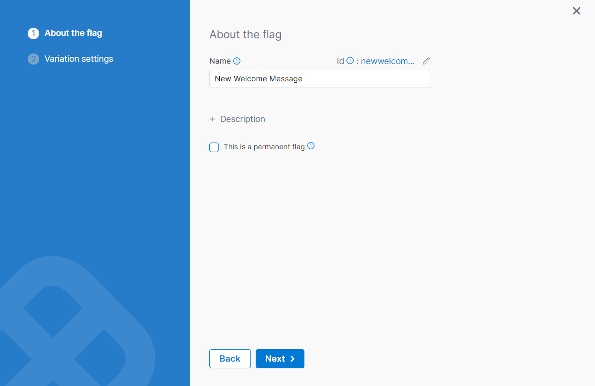

1. Create a new multivariate feature flag called `hex-color` and confirm the ID is `hexcolor`. Add three variants with the following names and values: red - `c05543`, green - `2f5230`, and blue - `0d507b`.

    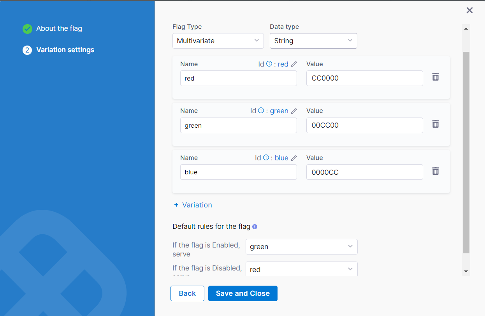

1. Create a new multivariate feature flag called `fib-algo` and confirm the ID is `fibalgo`. Add these variants to both the name and value: `recursive`, `memo`, `loop`, `binet`, and `default`.

    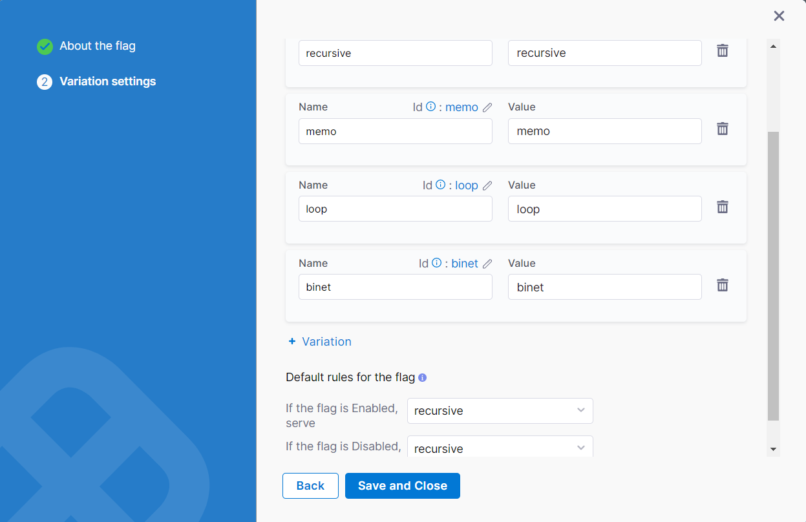

1. Add a new targeting group called `Fib3r Employees` by going to `Target Management` > `Target Groups` > `New Target Group`.
1. Add a targeting condition that looks for the `Identifier` to end with `@faas.com`.
1. Add the fib-algo flag and set the variation to `binet`.

    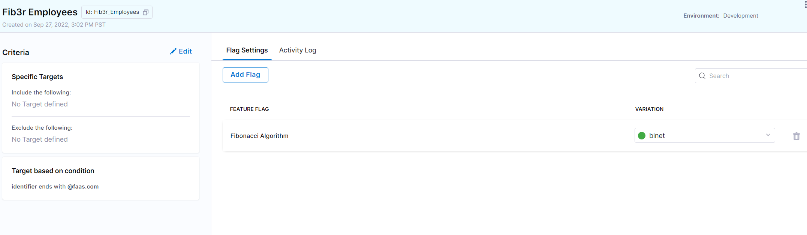

1. Create new server and client SDK keys. This can be done by navigating to `Environments` > `Development` > `New SDK Key`.
1. Open the `.env` file and set the values of `HARNESS_KEY` and `HARNESS_KEY_WEB` to the keys copied above.

Now that everything is configured, you should be able to [start the demo](#how-to-run-the-demo). Once it's started, select `harness` from the provider list located at the bottom right of your screen. You should now be able to control the demo app via Harness!
</details>

### LaunchDarkly

[LaunchDarkly](https://launchdarkly.com/) unleashes developer productivity for the software-powered world by fundamentally changing how you deliver software to your customers. With LaunchDarkly's feature management platform, empowered developers can empower the business to release new features faster and more efficiently than ever.

<details>
  <summary>Follow these steps to set up LaunchDarkly for the demo:</summary>

1. Sign in to your LaunchDarkly account. If you don't already have an account, you can sign up for a [free trial](https://launchdarkly.com/pricing/).
1. Create a new feature flag with the key `new-welcome-message` using the default boolean flag variation.
1. Go to "Settings" for this flag and ensure that `"SDKs using Client-side ID"` is checked under `"Client-side SDK availability"`.

    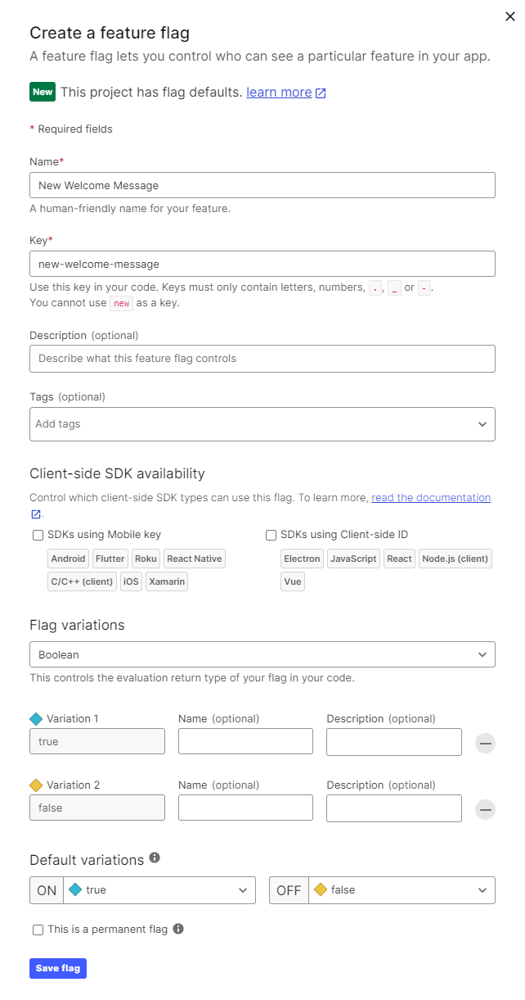

1. Create a new feature flag with the key `hex-color`. Set the flag variations to `string` and add three variations with the following variation and name: `c05543` - red, `2f5230` - green, and `0d507b` - blue.
1. Go to the "Settings" for this flag and ensure that `"SDKs using Client-side ID"` is checked under `"Client-side SDK availability"`.

    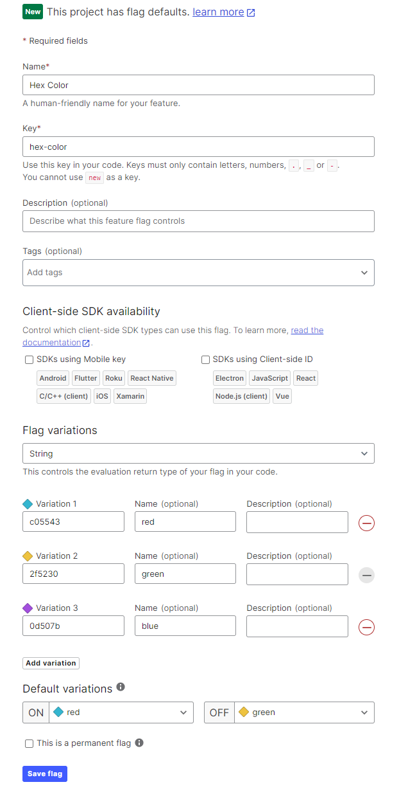

1. Create a new feature flag with the key `fib-algo`. Set the flag variations to `string` and add these variants to both the variation and name: `recursive`, `memo`, `loop`, `binet`, and `default`.

    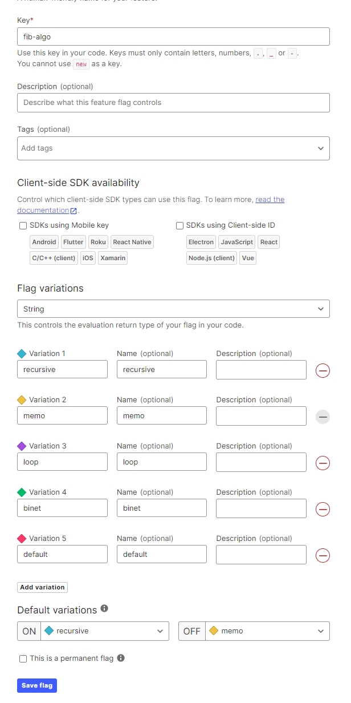

1. Select the `fib-algo` flag and add a targeting rule that looks for the `email` to end with `@faas.com` and serves `binet`.

    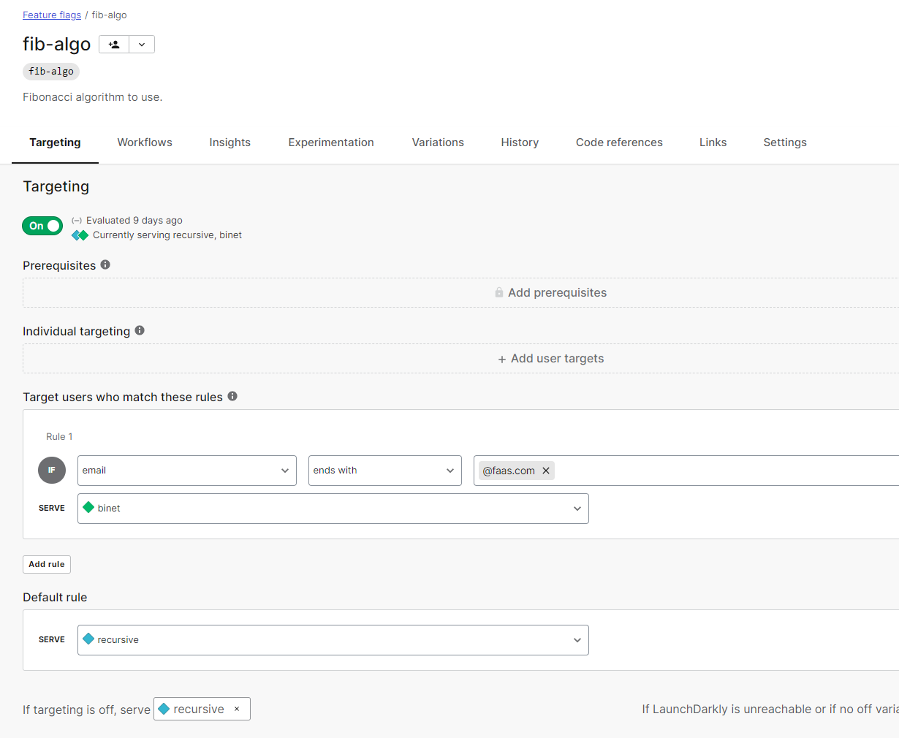

1. Navigate to `Account settings` > `Environments` and copy the `SDK Key` and `Client-side ID` associated with the environment you would like to use.
1. Open the `.env` file and set the values of `LD_KEY` and `LD_KEY_WEB` to the `SDK Key` and `Client-side ID` of the key copied above.

Now that everything is configured, you should be able to [start the demo](#how-to-run-the-demo). Once it's started, select `launchdarkly` from the provider list located at the bottom right of your screen. You should now be able to control the demo app via LaunchDarkly!
</details>

### Flagsmith

[Flagsmith](https://flagsmith.com/) is an open source, fully featured, Feature Flag and Remote Config service. They support a low latency hosted Edge API, deployment to your own private cloud, or running on-premise. Flagsmith makes it easy to create and manage features across web, mobile, and server side applications.

<details>
  <summary>Follow these steps to set up Flagsmith for the demo:</summary>

1. Sign in to your Flagsmith account. If you don't already have an account, you can sign up for the [free plan](https://flagsmith.com/pricing/).
1. Navigate to `Environment` > `Development` > `Features`.
1. Create a new feature with the id `new-welcome-message`. Enabled the feature and add a `true` and `false` variation values. Confirm that `true` is the control value and set it to 100%.

    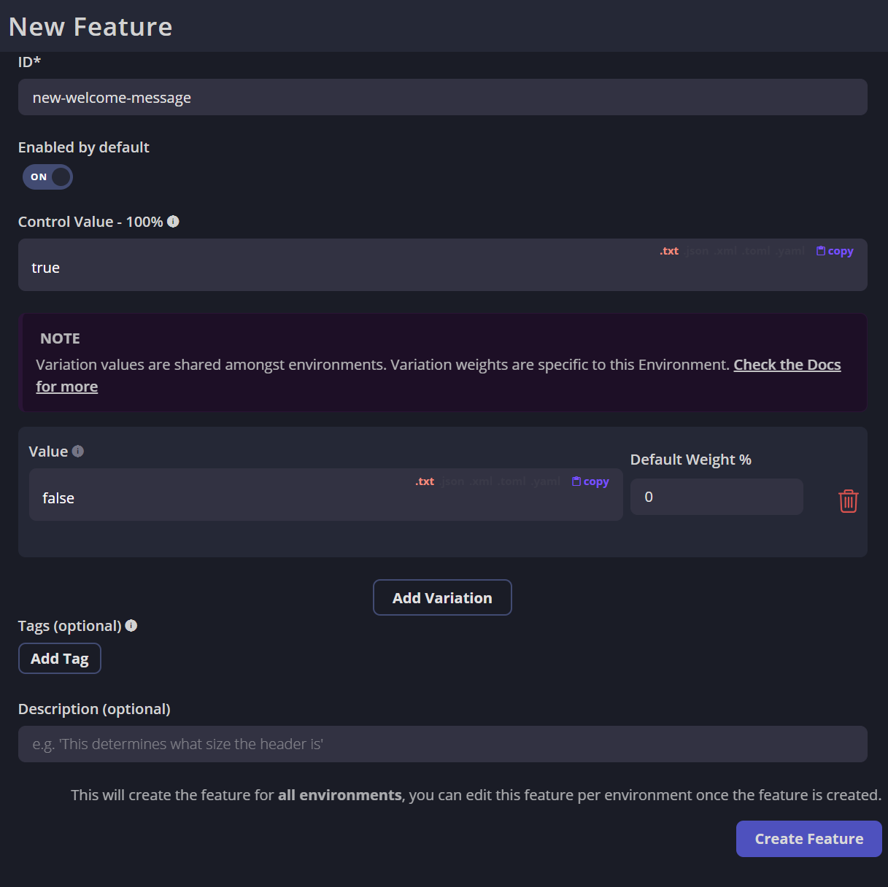

1. Create a new feature with the id `hex-color`. Enabled the feature and add a `c05543`, `2f5230`, and `0d507b` variation values. Confirm that `c05543` is the control value and set it to 100%.

    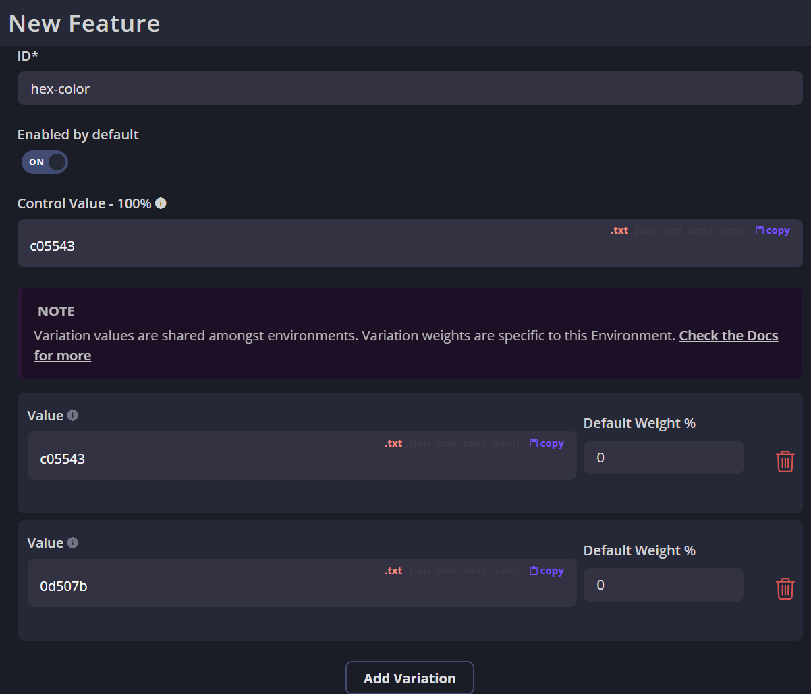

1. Create a new feature with the id `fib-algo`. Enabled the feature and add a `recursive`, `memo`, `loop`, `binet`, and `default` variation values. Confirm that `recursive` is the control value and set it to 100%.

    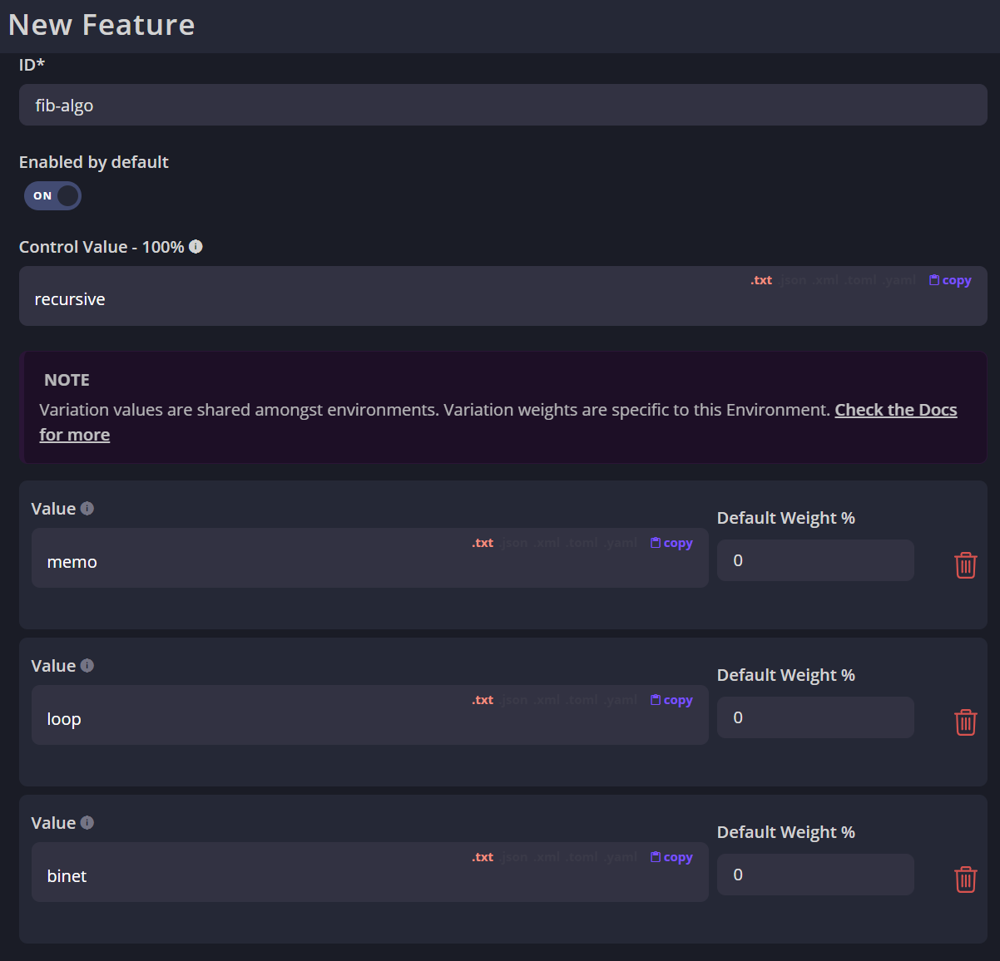

1. Create a new segment called `fib3r_employees` and add a rule that checks if email trait `email` contains `@faas.com`.

    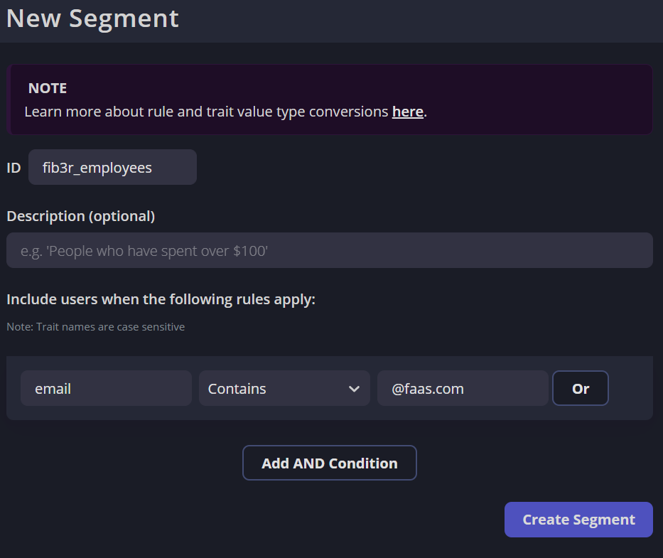

1. Select the `fib-algo` feature under the development environment and add a segment override. Select the `fib3r_employees` override, enable the override, and confirm the control is set to `binet`.

    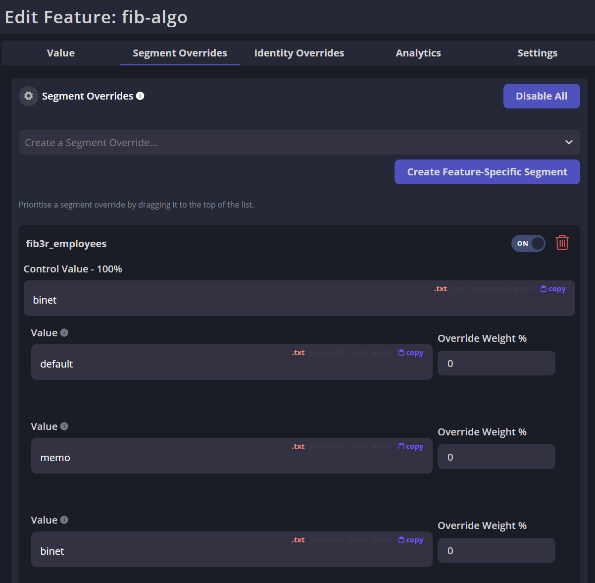

1. Navigate to `Environments` > `Development` > `Settings` and create a new server-side environment key.

    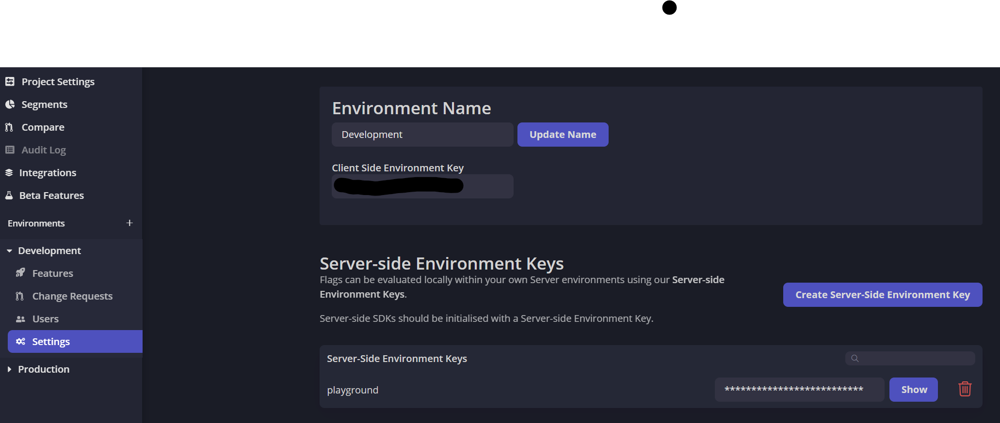

1. Open the `.env` file and set the values of `FLAGSMITH_ENV_KEY` the key copied above, and `FLAGSMITH_ENV_KEY_WEB` to the value of the `"Client-side Environment Key"` shown in the Flagsmith UI.

Now that everything is configured, you should be able to [start the demo](#how-to-run-the-demo). Once it's started, select `flagsmith` from the provider list located at the bottom right of your screen. You should now be able to control the demo app via Flagsmith!
</details>

### Flipt

[Flipt](https://www.flipt.io/) is an open-source feature management platform that's fully self-hosted.

To use preconfigured flags, copy the SQLite database backup in [`./config/flipt/flipt.example.db`](config/flipt/flipt.example.db) to [`./config/flipt/flipt.db`](config/flipt/flipt.db) before running `docker compose up`.

```shell
cp ./config/flipt/flipt.example.db ./config/flipt/flipt.db
```

## Experimenting beyond the demo

### Evaluation context

The following evaluation context is available during flag evaluation. That means any of these properties can be used when defining a rule in the feature flag manager of your choosing.

| Name         | Description                                                                            |
| ------------ | -------------------------------------------------------------------------------------- |
| ip           | The IP address sent from the browser. This comes from the `x-forwarded-for` header.    |
| email        | The email address of the logged-in user. Returns `anonymous` if the user is logged out |
| targetingKey | Same as email                                                                          |
| method       | The HTTP method used (e.g. GET, POST, PUT)                                             |
| path         | The HTTP path of the request (e.g. /hex-color)                                         |
| ts           | The current time in milliseconds                                                       |

## Troubleshooting

### Ports are not available

Confirm that the following ports are available `30000`, `8013`, and `16686`.

### Vendor isn't listed in the dropdown

To add a vendor to the demo, follow the vendor-specific section in the documentation. An SDK key **must** be added to the appropriate property in the `.env` file and the demo needs to be restarted.

### The UI is always grey

This means that the provider you've select either doesn't support client-side (see [what's in the demo](#whats-in-the-demo) section) or it's not working properly.
Ensure you've correctly configured the respective client-side provider, including the credentials.
